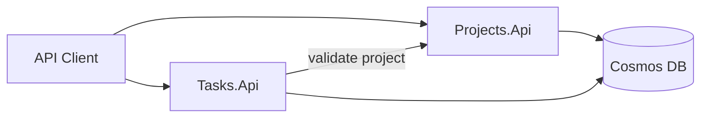

# TNTU Internship 2026 - Team Task Board

A **1-month student internship project** building a minimal **microservices-based task board** with **ASP.NET Core**, **EF Core**, **Azure Cosmos DB**, and **GitHub Actions** CI/CD.

Students implement two cooperating APIs — **Projects** and **Tasks** — deploy them to Azure free tier, and learn modern backend development practices along the way.

---

## What you will build

| Service | Responsibility |
|---------|----------------|
| **Projects.Api** | Create, list, update, and archive projects |
| **Tasks.Api** | Manage tasks within projects; validates projects via HTTP |



Implementation code lives under `src/`.

---

## Documentation

Start here based on your role:

| Document | Audience | Description |
|----------|----------|-------------|
| [Development Prerequisites](docs/prerequisites/development-prerequisites.md) | Students (Day 1) | Software to install, Azure/GitHub accounts, environment variables |
| [Architecture and Tech Stack](docs/architecture/architecture-and-tech-stack.md) | Students, mentors | System design, conventions, ADRs, learning links |
| [System Overview](docs/domain/system-overview.md) | Students, mentors | Domain model, business rules, entity definitions |
| [One-Month Schedule](docs/internship-plan/one-month-schedule.md) | Students, mentors | Week-by-week plan, demo script, grading rubric |
| [User Stories](docs/user-stories/README.md) | Students | 18 user stories with acceptance criteria and API contracts |

---

## Project Overview

The project models a simple task board for small teams:

- Projects store the top-level work item and can be created, listed, updated, viewed, and archived.
- Tasks belong to a project and can be created, listed, viewed, updated, deleted, and moved through a controlled status lifecycle.
- Tasks.Api validates project existence by calling Projects.Api over HTTP before creating or listing tasks.

The domain rules, API contracts, and sprint plan are documented in [docs/domain/system-overview.md](docs/domain/system-overview.md), [docs/architecture/architecture-and-tech-stack.md](docs/architecture/architecture-and-tech-stack.md), and [docs/user-stories/README.md](docs/user-stories/README.md).

---

## Architecture

The system is split into two services with separate responsibilities and separate Cosmos DB containers:

| Service | Responsibility |
|---|---|
| Projects.Api | Create, list, get, update, and archive projects |
| Tasks.Api | Create, list, get, update, delete, and change task status within a project |


Key architecture facts:

- Projects are stored in the `projects` container with partition key `/id`.
- Tasks are stored in the `tasks` container with partition key `/projectId`.
- Tasks.Api uses Projects.Api for project validation before creating a task.
- Health checks are mapped at `/health` in both services.
- Swagger UI is enabled in Development mode for both APIs.

See [docs/architecture/architecture-and-tech-stack.md](docs/architecture/architecture-and-tech-stack.md) for the full architecture, cross-service flow, and CI/CD overview.

---

## User Story Coverage

The README-related requirements come primarily from these stories:

- US-012 requires documenting health checks.
- US-013 requires documenting RFC 7807 Problem Details.
- US-014 requires the README to mention CI.
- US-015 requires documenting deployment settings and secrets at a high level.
- US-017 requires documenting Dockerfile-based container runs.
- US-018 requires documenting Docker Compose local development.

The rest of the user stories define the API surface and business rules this project implements.

---

## Tech Stack

| Layer | Technology |
|-------|------------|
| Runtime | .NET 8 |
| API framework | ASP.NET Core Web API |
| ORM | Entity Framework Core + Cosmos DB provider |
| Database | Azure Cosmos DB (free tier) |
| Hosting | Azure App Service F1 |
| CI/CD | GitHub Actions |
| Testing | xUnit |
| Optional | Docker, Docker Compose |

Full details and documentation links: [Architecture and Tech Stack](docs/architecture/architecture-and-tech-stack.md).

---

## Prerequisites

Complete the items in [docs/prerequisites/development-prerequisites.md](docs/prerequisites/development-prerequisites.md) before starting local development. The minimum practical setup is:

- .NET 8 SDK
- Git
- Docker Desktop if you want to use the Compose workflow
- Cosmos DB Emulator on Windows, or a reachable Cosmos DB account in Azure

If you are on Windows, the Cosmos DB Emulator is the simplest local option. The current Compose file expects a Cosmos endpoint at `https://localhost:8081/` by default via `.env.example`.

---

## Quick Start for Students

1. Complete the [prerequisites checklist](docs/prerequisites/development-prerequisites.md#verification-steps).
2. Read [architecture](docs/architecture/architecture-and-tech-stack.md) and [domain overview](docs/domain/system-overview.md).
3. Follow the [Week 1 schedule](docs/internship-plan/one-month-schedule.md#week-1--environment-and-projects-api-foundation).
4. Implement user stories in order starting with [US-001](docs/user-stories/US-001-create-project.md).

---

## User Stories at a Glance

| Sprint | Stories | Focus |
|--------|---------|-------|
| Week 1 | US-001 – US-003 | Projects API — create, list, get |
| Week 2 | US-004 – US-008 | Projects complete + Tasks API start |
| Week 3 | US-009 – US-015 | Tasks complete + Azure + CI/CD |
| Week 4 | US-016 – US-018 (optional) | Filter, Docker, final demo |

Full index: [User Stories](docs/user-stories/README.md).

---

## Repository Structure

```text
TNTU.Internship2026/
├── README.md
└── docs/
    ├── architecture/
    │   └── architecture-and-tech-stack.md
    ├── prerequisites/
    │   └── development-prerequisites.md
    ├── domain/
    │   └── system-overview.md
    ├── internship-plan/
    │   └── one-month-schedule.md
    └── user-stories/
        ├── README.md
        └── US-001-create-project.md … US-018-docker-compose-local.md
```

Planned source layout:

```text
src/
├── Projects.Api/
├── Projects.Api.Tests/
├── Tasks.Api/
├── Tasks.Api.Tests/
└── docker-compose.yml          # optional, week 4
```

The service source code lives under `src/Projects.Api` and `src/Tasks.Api`, with corresponding test projects under `src/Projects.Api.Tests` and `src/Tasks.Api.Tests`.

---

## Local Setup & Running

### Option 1: Run with Docker Compose

This repository includes a root [docker-compose.yml](docker-compose.yml) that builds and starts both APIs.

1. Copy `.env.example` to `.env` if you need to override the default values.
2. Make sure a Cosmos DB endpoint is available at the address configured in `.env`.
3. Start the services:

```powershell
docker compose up --build
```

The compose file currently exposes:

- Projects.Api on [http://localhost:5001](http://localhost:5001)
- Tasks.Api on [http://localhost:5002](http://localhost:5002)

The containers listen on port `8080` internally and the Tasks service is configured to reach Projects.Api through the Compose network name `http://projects-api:8080`.

Stop and remove containers with:

```powershell
docker compose down
```

### Option 2: Run from the .NET CLI

If you want to run the APIs directly from your machine, use the launch profiles configured in each service:

```powershell
dotnet run --project src/Projects.Api
dotnet run --project src/Tasks.Api
```

The local HTTP ports from the launch settings are:

- Projects.Api: `http://localhost:5285`
- Tasks.Api: `http://localhost:5124`

---

## Environment Variables

The root [`.env.example`](.env.example) file documents the values used by Docker Compose. Copy it to `.env` and override values as needed.

| Variable | Purpose | Default |
|---|---|---|
| `COSMOS_ENDPOINT` | Cosmos DB endpoint used by both APIs | `https://localhost:8081/` |
| `COSMOS_KEY` | Cosmos DB key | Emulator default key |
| `COSMOS_DATABASE` | Cosmos DB database name | `TaskBoard` |
| `APPLICATIONINSIGHTS_CONNECTION_STRING` | Optional Application Insights connection string | Empty |

Compose maps those variables into the application configuration keys expected by the services:

- `CosmosDb__Endpoint`
- `CosmosDb__Key`
- `CosmosDb__DatabaseName`
- `ProjectsApi__BaseUrl` for Tasks.Api

For Azure App Service, the same settings should be provided in Application settings using double underscores, for example `CosmosDb__Endpoint` and `ProjectsApi__BaseUrl`.

---

## API Endpoints

Both services expose Swagger UI in Development mode:

- Projects.Api Swagger: [http://localhost:5285/swagger](http://localhost:5285/swagger) when running locally without Docker
- Tasks.Api Swagger: [http://localhost:5124/swagger](http://localhost:5124/swagger) when running locally without Docker

When running with Docker Compose, the published ports are:

- Projects.Api Swagger: [http://localhost:5001/swagger](http://localhost:5001/swagger)
- Tasks.Api Swagger: [http://localhost:5002/swagger](http://localhost:5002/swagger)

Health check endpoints:

- Projects.Api: [http://localhost:5001/health](http://localhost:5001/health) or [http://localhost:5285/health](http://localhost:5285/health)
- Tasks.Api: [http://localhost:5002/health](http://localhost:5002/health) or [http://localhost:5124/health](http://localhost:5124/health)

Main REST endpoints are versioned under `/api/v1/`.

### Projects.Api

- `POST /api/v1/projects` - create a project
- `GET /api/v1/projects` - list non-archived projects
- `GET /api/v1/projects/{id}` - get project by ID
- `PUT /api/v1/projects/{id}` - update project
- `PATCH /api/v1/projects/{id}/archive` - archive project

### Tasks.Api

- `POST /api/v1/projects/{projectId}/tasks` - create a task
- `GET /api/v1/projects/{projectId}/tasks` - list tasks for a project
- `GET /api/v1/projects/{projectId}/tasks/{taskId}` - get task by ID
- `PUT /api/v1/projects/{projectId}/tasks/{taskId}` - update task
- `PATCH /api/v1/projects/{projectId}/tasks/{taskId}/status` - change task status
- `DELETE /api/v1/projects/{projectId}/tasks/{taskId}` - delete task

Error responses use RFC 7807 Problem Details (`application/problem+json`). The expected status codes are `400`, `404`, `409`, `502`, and `503` depending on the scenario.

---

## Cross-Service Behavior

Tasks.Api calls Projects.Api before creating a task and before returning task lists for a project.

Expected outcomes:

- If the project exists and is active, task operations continue.
- If the project does not exist, Tasks.Api returns `404 Not Found`.
- If the project is archived, task creation returns `409 Conflict`.
- If Projects.Api is unavailable, Tasks.Api returns `502 Bad Gateway`.

---

## CI/CD

The documentation and acceptance criteria require GitHub Actions for both continuous integration and deployment:

- CI should restore and test the solution on pull requests and pushes.
- CD should deploy both APIs to Azure App Service on merge to `main`.
- Azure credentials must be stored in GitHub Secrets or configured through OIDC; never commit secrets.

See [docs/user-stories/US-014-github-actions-ci.md](docs/user-stories/US-014-github-actions-ci.md) and [docs/user-stories/US-015-github-actions-cd.md](docs/user-stories/US-015-github-actions-cd.md) for the required behavior.

---

## Notes on the Current Compose Setup

The current `docker-compose.yml` starts both APIs and wires Tasks.Api to Projects.Api over the Compose network. It does not define a Cosmos DB container, healthcheck blocks, or named volumes yet, so the local Cosmos endpoint must be provided externally through `.env` or another reachable Cosmos instance.

That means the Compose workflow is copy-pasteable today, but it depends on a reachable Cosmos DB endpoint. If you want a fully isolated emulator-based setup, the Compose file must be extended to add the emulator service and persistence volumes.

---

## Related Documentation

- [User Stories](docs/user-stories/README.md)
- [Architecture and Tech Stack](docs/architecture/architecture-and-tech-stack.md)
- [System Overview](docs/domain/system-overview.md)
- [Development Prerequisites](docs/prerequisites/development-prerequisites.md)
- [One-Month Schedule](docs/internship-plan/one-month-schedule.md)

---

## License and Usage

This project is intended for educational use at TNTU. Mentors may adapt documentation and scope as needed.
